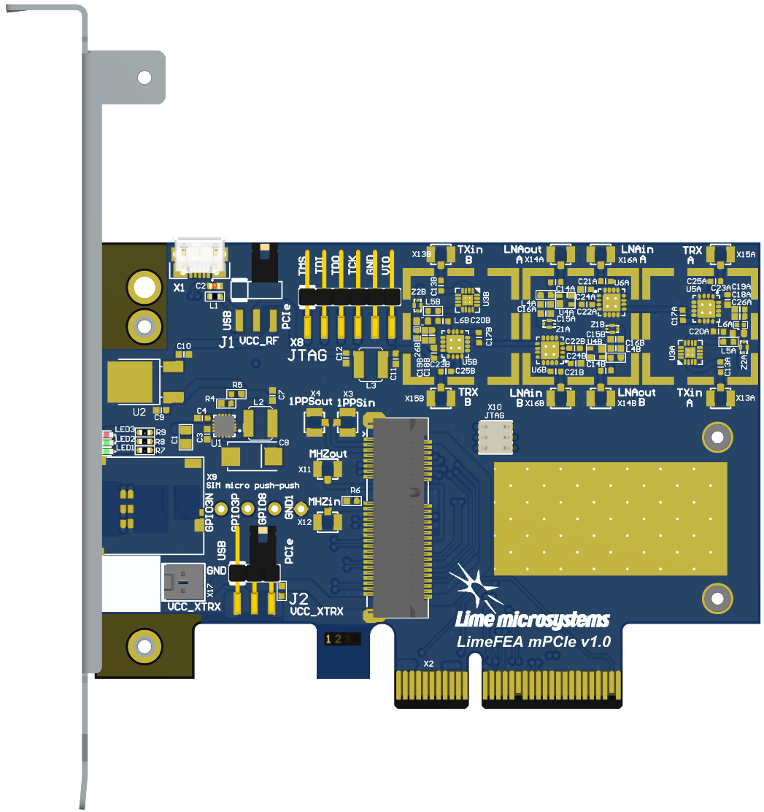

LimeFEA mPCIe v1.0 Board
========================

  Figure 1: LimeFEA mPCIe v1.0 board

Introduction
============

The LimeFEA mPCIe is 2 lane PCIe to mini PCIe adapter that provides a hardware platform for developing and prototyping high-performance designs with mini PCIe cards. It comes equipped with RF front end (RFFE) that is compatible with LimeSDR XTRX.

  Figure 2: LimeFEA mPCIe v1.0 board top view

Also lite version of LimeFEA mPCIe is availabe without RFFE, nano-SIM socket and synchronization connectors.

  
  Figure 3: LimeFEA mPCIe v1.0 lite version board top view

LimeFEA mPCIe board features:

* Connectors:

  * PCIe x4 card edge connector (2 PCIe lanes)
  * mini PCIe (1.55 mm heigth) connector (2 PCIe lanes)
  * USB 2.0 microB
  * JTAG (2.54 mm pitch) header that is connected to a spring connector (for LimeSDR XTRX)
  * Nano-SIM socket
  * Coaxial RF (12x U.FL female) connectors for RF front end and synchronization signals 
 
* RF front end:

  * Configuration: MIMO (2x TRX, 2x RX)
  * LNAs, PAs, RF switches, power and mode control (TDD and FDD)

* General user inputs/outputs:

  * 3x general purpose LEDs (PCIe indication by default)
  * 3x general purpose I/Os (unpopulated)
  * Power source selection for mini PCIe card and RFFE (2.54 mm pitch headers)

* Board power sources:

  * Header (5 V/3.3 V)
  * USB (5 V)
  * PCIe (3.3 V)

* Board size: 68.9mm x 100mm (Low-Profile PCIe expansion card)

For more information on the following topics, refer to `LimeSDR XTRX documentation. <https://LimeSDR-XTRX.myriadrf.org>`_ 

Board Overview
-------------- 

The heart of the LimeFEA mPCIe adapter board is mPCIe x2 socket compatible with LimeSDR XTRX. LimeFEA mPCIe provides user with SIM micro socket and RF front end (RFFE). The block diagram for LimeFEA mPCIe board is as shown in figure 4.

  Figure 4: LimeFEA mPCIe v1.0 block diagram

LimeFEA mPCIe v1.0 board picture with highlighted connectors and main components are presented in figure 5.

  Figure 5: LimeFEA mPCIe v1.0 connectors and main components

Board components are described in the table 1

.. table:: Table 1. Board components

  +----------------------------------------------------------------------------------------------------+
  | **Configuration, Status, Setup Elements**                                                          |
  +-------------------------+-------------------+------------------------------------------------------+
  | LED1                    | Green status LED  | PCIe WWAN                                            |
  +-------------------------+-------------------+------------------------------------------------------+
  | LED2                    | Green status LEDs | PCIe WLAN                                            |
  +-------------------------+-------------------+------------------------------------------------------+
  | LED3                    | RED status LED    | PCIe WPAN                                            |
  +-------------------------+-------------------+------------------------------------------------------+
  | X8                      | 2.54 mm Header    | JTAG                                                 |
  +-------------------------+-------------------+------------------------------------------------------+
  | X10                     | Spring            | JTAG                                                 |
  +-------------------------+-------------------+------------------------------------------------------+
  | **RF Front End**                                                                                   |
  +-------------------------+-------------------+------------------------------------------------------+
  | U3A, U3B                | IC                | PA TQP3M9018                                         |
  +-------------------------+-------------------+------------------------------------------------------+
  | U4A, U4B                | IC                | LNA SPF5043Z                                         |
  +-------------------------+-------------------+------------------------------------------------------+
  | U5A, U6A,   U5B, U6B    | IC                | RF switch SKY13286                                   |
  +-------------------------+-------------------+------------------------------------------------------+
  | GPIO3P,   GPIO3N, GPIO8 | Header            | TDD control (LimeSDR XTRX) / user defined            |
  +-------------------------+-------------------+------------------------------------------------------+
  | X13A, X13B              | U.FL              | TX in                                                |
  +-------------------------+-------------------+------------------------------------------------------+
  | X15A, X15B              | U.FL              | TRX (TX out / RX in)                                 |
  +-------------------------+-------------------+------------------------------------------------------+
  | X16A, X16B              | U.FL              | LNA in ( RX in)                                      |
  +-------------------------+-------------------+------------------------------------------------------+
  | X14A, X14B              | U.FL              | LNA out (RX out)                                     |
  +-------------------------+-------------------+------------------------------------------------------+
  | **Communication Ports**                                                                            |
  +-------------------------+-------------------+------------------------------------------------------+
  | X2                      | PCIe              | PCIe x4 edge connector (2 PCIe lanes)                |
  +-------------------------+-------------------+------------------------------------------------------+
  | X5                      | mPCIe             | 1.55 mm height mini PCIe connector (2 PCIe lanes)    |
  +-------------------------+-------------------+------------------------------------------------------+
  | X1                      | USB               | USB 2.0 microB                                       |
  +-------------------------+-------------------+------------------------------------------------------+
  | X9                      | UIM               | micro SIM push-push                                  |
  +-------------------------+-------------------+------------------------------------------------------+
  | **Clock Circuitry**                                                                                |
  +-------------------------+-------------------+------------------------------------------------------+
  | X3                      | U.FL              | PPS in (used by LimeSDR XTRX)                        |
  +-------------------------+-------------------+------------------------------------------------------+
  | X4                      | U.FL              | PPS out (used by LimeSDR XTRX)                       |
  +-------------------------+-------------------+------------------------------------------------------+
  | X11                     | U.FL              | clock output (used by LimeSDR XTRX)                  |
  +-------------------------+-------------------+------------------------------------------------------+
  | X12                     | U.FL              | clock input  (used by LimeSDR XTRX)                  |
  +-------------------------+-------------------+------------------------------------------------------+
  | **Power Supply**                                                                                   |
  +-------------------------+-------------------+------------------------------------------------------+
  | U1                      | IC                | Switching regulator TPS62130RG (+5V6 rail)           |
  +-------------------------+-------------------+------------------------------------------------------+
  | U2                      | IC                | Linear regulator NCP5501DT50G (+5V rail)             |
  +-------------------------+-------------------+------------------------------------------------------+
  | J1                      | Header            | +5VRF source selection (RFFE)                        |
  +-------------------------+-------------------+------------------------------------------------------+
  | J2                      | Header            | +VCXTRX source selection (mPCIe)                     |
  +-------------------------+-------------------+------------------------------------------------------+
  | X17                     | Header            | +VCXTRX power input (when PCIE or USB not available) |
  +-------------------------+-------------------+------------------------------------------------------+

LimeFEA mPCIe Board Architecture
================================

This chapter is dedicated for detail description of LimeFEA mPCIe board components and interconnections.

PCIe x4 Edge Connector 
----------------------

LimeFEA mPCIe board is a low-profile PCIe expansion card designed to fit into x4 (or bigger) slots (2 PCIe lanes are used). PCIe edge connector pinuot, schematic signal names and descriptions are listed in table 2.

.. table:: Table 2. PCIe edge connector (X2) pinout

  +---------+----------------------------------+---------------------------+------------------------------------+
  | **Pin** | **PCIe Specification Reference** | **Schematic Signal Name** | **PCIe Specification Description** |
  +---------+----------------------------------+---------------------------+------------------------------------+
  | B1      | +12V                             | +12VIN                    | Power   (12V)                      |
  +---------+----------------------------------+---------------------------+------------------------------------+
  | A1      | PRSNT#1                          | SIZEX4                    | Hot plug   detect                  |
  +---------+----------------------------------+---------------------------+------------------------------------+
  | B2      | +12V                             | +12VIN                    | Power   (12V)                      |
  +---------+----------------------------------+---------------------------+------------------------------------+
  | A2      | +12V                             | +12VIN                    | Power   (12V)                      |
  +---------+----------------------------------+---------------------------+------------------------------------+
  | B3      | +12V                             | +12VIN                    | Power   (12V)                      |
  +---------+----------------------------------+---------------------------+------------------------------------+
  | A3      | +12V                             | +12VIN                    | Power   (12V)                      |
  +---------+----------------------------------+---------------------------+------------------------------------+
  | B4      | GND                              | GND                       | Ground   (0V)                      |
  +---------+----------------------------------+---------------------------+------------------------------------+
  | A4      | GND                              | GND                       | Ground   (0V)                      |
  +---------+----------------------------------+---------------------------+------------------------------------+
  | B5      | SMBCLK                           | NC                        | SMBus clock                        |
  +---------+----------------------------------+---------------------------+------------------------------------+
  | A5      | JTAG-TCK                         | NC                        | TCK                                |
  +---------+----------------------------------+---------------------------+------------------------------------+
  | B6      | SMBDAT                           | NC                        | SMBus data                         |
  +---------+----------------------------------+---------------------------+------------------------------------+
  | A6      | JTAG-TDI                         | NC                        | TDI                                |
  +---------+----------------------------------+---------------------------+------------------------------------+
  | B7      | GND                              | GND                       | Ground   (0V)                      |
  +---------+----------------------------------+---------------------------+------------------------------------+
  | A7      | JTAG-TDO                         | NC                        | TDO                                |
  +---------+----------------------------------+---------------------------+------------------------------------+
  | B8      | +3.3V                            | +3,3VPCI                  | Power (3.3V)                       |
  +---------+----------------------------------+---------------------------+------------------------------------+
  | A8      | JTAG-TMS                         | NC                        | TMS                                |
  +---------+----------------------------------+---------------------------+------------------------------------+
  | B9      | JTAG-RST                         | NC                        | +TRST#                             |
  +---------+----------------------------------+---------------------------+------------------------------------+
  | A9      | +3.3V                            | +3,3VPCI                  | Power   (3.3V)                     |
  +---------+----------------------------------+---------------------------+------------------------------------+
  | B10     | +3.3Vaux                         | NC                        | Power   (3.3V)                     |
  +---------+----------------------------------+---------------------------+------------------------------------+
  | A10     | +3.3V                            | +3,3VPCI                  | Power   (3.3V)                     |
  +---------+----------------------------------+---------------------------+------------------------------------+
  | B11     | Wake#                            | NC                        | Link   reactivation                |
  +---------+----------------------------------+---------------------------+------------------------------------+
  | A11     | PWRGOOD                          | PCI_PERST#                | Reset signal                       |
  +---------+----------------------------------+---------------------------+------------------------------------+
  | B12     | Reserved                         | NC                        | No connection                      |
  +---------+----------------------------------+---------------------------+------------------------------------+
  | A12     | GND                              | GND                       | Ground   (0V)                      |
  +---------+----------------------------------+---------------------------+------------------------------------+
  | B13     | GND                              | GND                       | Ground   (0V)                      |
  +---------+----------------------------------+---------------------------+------------------------------------+
  | A13     | REFCLK+                          | PCI_REF_CLK_P             | Reference clock +                  |
  +---------+----------------------------------+---------------------------+------------------------------------+
  | B14     | HSOp(TX0p)                       | PCI_RX0_P                 | Transmitter lane 0 +               |
  +---------+----------------------------------+---------------------------+------------------------------------+
  | A14     | REFCLK-                          | PCI_REF_CLK_N             | Reference clock -                  |
  +---------+----------------------------------+---------------------------+------------------------------------+
  | B15     | HSOn(TX0n)                       | PCI_RX0_N                 | Transmitter lane 0 -               |
  +---------+----------------------------------+---------------------------+------------------------------------+
  | A15     | GND                              | GND                       | Ground   (0V)                      |
  +---------+----------------------------------+---------------------------+------------------------------------+
  | B16     | GND                              | GND                       | Ground   (0V)                      |
  +---------+----------------------------------+---------------------------+------------------------------------+
  | A16     | HSIp(Rx0p)                       | PCI_TX0_P                 | Receiver lane   0 +                |
  +---------+----------------------------------+---------------------------+------------------------------------+
  | B17     | PRSNT#1 (x1)                     | NC                        | Hotplug   detect                   |
  +---------+----------------------------------+---------------------------+------------------------------------+
  | A17     | HSIn(Rx0n)                       | PCI_TX0_N                 | Receiver lane   0 -                |
  +---------+----------------------------------+---------------------------+------------------------------------+
  | B18     | GND                              | GND                       | Ground   (0V)                      |
  +---------+----------------------------------+---------------------------+------------------------------------+
  | A18     | GND                              | GND                       | Ground   (0V)                      |
  +---------+----------------------------------+---------------------------+------------------------------------+
  | B19     | HSOp(Tx1p)                       | PCI_RX1_P                 | Transmitter lane 1 +               |
  +---------+----------------------------------+---------------------------+------------------------------------+
  | A19     | Reserved                         | NC                        | No connection                      |
  +---------+----------------------------------+---------------------------+------------------------------------+
  | B20     | HSOn(Tx1n)                       | PCI_RX1_N                 | Transmitter lane 1 -               |
  +---------+----------------------------------+---------------------------+------------------------------------+
  | A20     | GND                              | GND                       | Ground   (0V)                      |
  +---------+----------------------------------+---------------------------+------------------------------------+
  | B21     | GND                              | GND                       | Ground   (0V)                      |
  +---------+----------------------------------+---------------------------+------------------------------------+
  | A21     | HSIp(Rx1p)                       | PCI_TX1_P                 | Receiver lane   1 +                |
  +---------+----------------------------------+---------------------------+------------------------------------+
  | B22     | GND                              | GND                       | Ground   (0V)                      |
  +---------+----------------------------------+---------------------------+------------------------------------+
  | A22     | HSIn(Rx1n)                       | PCI_TX1_N                 | Receiver lane   1 -                |
  +---------+----------------------------------+---------------------------+------------------------------------+
  | B23     | HSOp(Tx2p)                       | NC                        | Transmitter lane 2 +               |
  +---------+----------------------------------+---------------------------+------------------------------------+
  | A23     | GND                              | GND                       | Ground   (0V)                      |
  +---------+----------------------------------+---------------------------+------------------------------------+
  | B24     | HSOn(Tx2n)                       | NC                        | Transmitter lane 2 -               |
  +---------+----------------------------------+---------------------------+------------------------------------+
  | A24     | GND                              | GND                       | Ground   (0V)                      |
  +---------+----------------------------------+---------------------------+------------------------------------+
  | B25     | GND                              | GND                       | Ground   (0V)                      |
  +---------+----------------------------------+---------------------------+------------------------------------+
  | A25     | HSIp(Rx2p)                       | NC                        | Receiver lane   2 +                |
  +---------+----------------------------------+---------------------------+------------------------------------+
  | B26     | GND                              | GND                       | Ground   (0V)                      |
  +---------+----------------------------------+---------------------------+------------------------------------+
  | A26     | HSIn(Rx2n)                       | NC                        | Receiver lane   2 -                |
  +---------+----------------------------------+---------------------------+------------------------------------+
  | B27     | HSOp(Tx3p)                       | NC                        | Transmitter lane 3 +               |
  +---------+----------------------------------+---------------------------+------------------------------------+
  | A27     | GND                              | GND                       | Ground   (0V)                      |
  +---------+----------------------------------+---------------------------+------------------------------------+
  | B28     | HSOn(Tx3n)                       | NC                        | Transmitter lane 3 -               |
  +---------+----------------------------------+---------------------------+------------------------------------+
  | A28     | GND                              | GND                       | Ground   (0V)                      |
  +---------+----------------------------------+---------------------------+------------------------------------+
  | B29     | GND                              | GND                       | Ground   (0V)                      |
  +---------+----------------------------------+---------------------------+------------------------------------+
  | A29     | HSIp(Rx3p)                       | NC                        | Receiver lane   3 +                |
  +---------+----------------------------------+---------------------------+------------------------------------+
  | B30     | Reserved                         | NC                        | No connection                      |
  +---------+----------------------------------+---------------------------+------------------------------------+
  | A30     | HSIn(Rx3n)                       | NC                        | Receiver lane   3 -                |
  +---------+----------------------------------+---------------------------+------------------------------------+
  | B31     | PRSNT#2 (x4)                     | SIZEX4                    | Hotplug   detect                   |
  +---------+----------------------------------+---------------------------+------------------------------------+
  | A31     | GND                              | GND                       | Ground   (0V)                      |
  +---------+----------------------------------+---------------------------+------------------------------------+
  | B32     | GND                              | GND                       | Ground   (0V)                      |
  +---------+----------------------------------+---------------------------+------------------------------------+
  | A32     | Reserved                         | NC                        | No connection                      |
  +---------+----------------------------------+---------------------------+------------------------------------+

Mini PCIe Socket
----------------

LimeFEA mPCIe board features mini PCIe specification compatible socket. Mini PCIe specification defines only 1 PCIe lane, but LimeFEA mPCIe features 2 PCIe lanes. Also mPCIe socket provides synchronization signals for LimeSDR XTRX board. More detailed information is listed in

.. table:: Table 3. mPCIe connector (X5) pinout

  +----------+-----------------------------+-----------------------------+----------------------------+------------------------------------------------------------------+
  |          | **Mini PCIe Specification** | **LimeFEA mPCIe Schematic** | **LimeSDR XTRX Schematic** |                                                                  |
  |          |                             |                             |                            |                                                                  |
  | **Pin**  | **Reference**               | **Signal Name**             | **Signal Name**            | **LimeSDR XTRX Description**                                     |
  +----------+-----------------------------+-----------------------------+----------------------------+------------------------------------------------------------------+
  | 1        | Wake#                       | NC/RPI_PCIE_DET_nWAKE       | NC                         | Not connected                                                    |
  +----------+-----------------------------+-----------------------------+----------------------------+------------------------------------------------------------------+
  | 2        | 3.3 Vaux                    | VCC3P3                      | VCC3P3_MPCIE               | Main power input                                                 |
  +----------+-----------------------------+-----------------------------+----------------------------+------------------------------------------------------------------+
  | 3        | COEX1                       | PCIE_COEX1                  | 1PPSI_GPIO1(1N)            | 1PPS input / GPIO1N                                              |
  +----------+-----------------------------+-----------------------------+----------------------------+------------------------------------------------------------------+
  | 4        | GND                         | GND                         | GND                        | Ground                                                           |
  +----------+-----------------------------+-----------------------------+----------------------------+------------------------------------------------------------------+
  | 5        | COEX2                       | PCIE_COEX2                  | 1PPSO_GPIO2(1P)            | 1PPS output / GPIO1P                                             |
  +----------+-----------------------------+-----------------------------+----------------------------+------------------------------------------------------------------+
  | 6        | GND                         | VCC1P5                      | NC                         | Not connected                                                    |
  +----------+-----------------------------+-----------------------------+----------------------------+------------------------------------------------------------------+
  | 7        | CLKREQ#                     | RPI_PCIE_CLK_nREQ           | CLK_REQUEST#               | Tied to GND through   330 Ω resistor                             |
  +----------+-----------------------------+-----------------------------+----------------------------+------------------------------------------------------------------+
  | 8        | UIM PWR                     | UIM_PWR                     | UIM_VCC                    | User Identity Module   interface power 1.8 V or 3V               |
  +----------+-----------------------------+-----------------------------+----------------------------+------------------------------------------------------------------+
  | 9        | GND                         | GND                         | GND                        | Ground                                                           |
  +----------+-----------------------------+-----------------------------+----------------------------+------------------------------------------------------------------+
  | 10       | UIM_DATA                    | UIM_DATA                    | UIM_DIO                    | User Identity Module   interface data 1.8 V or 3V                |
  +----------+-----------------------------+-----------------------------+----------------------------+------------------------------------------------------------------+
  | 11       | REFCLK-                     | RPI_PCIE_CLK_N              | PCI_REF_CLK_N              | PCI Express Reference   clock differential pair negative signal  |
  +----------+-----------------------------+-----------------------------+----------------------------+------------------------------------------------------------------+
  | 12       | UIM_CLK                     | UIM_CLK                     | UIM_CLK                    | User Identity Module   interface clock 1.8 V or 3V               |
  +----------+-----------------------------+-----------------------------+----------------------------+------------------------------------------------------------------+
  | 13       | REFCLK+                     | RPI_PCIE_CLK_P              | PCI_REF_CLK_P              | PCI Express Reference   clock differential pair positive signal  |
  +----------+-----------------------------+-----------------------------+----------------------------+------------------------------------------------------------------+
  | 14       | UIM_RESET                   | UIM_RESET                   | UIM_RST                    | User Identity Module   interface reset 1.8 V or 3V               |
  +----------+-----------------------------+-----------------------------+----------------------------+------------------------------------------------------------------+
  | 15       | GND                         | GND                         | GND                        | Ground                                                           |
  +----------+-----------------------------+-----------------------------+----------------------------+------------------------------------------------------------------+
  | 16       | UIM_VPP                     | UIM_VPP                     | NC                         | Not connected                                                    |
  +----------+-----------------------------+-----------------------------+----------------------------+------------------------------------------------------------------+
  | 17       | Reserved                    | PCIE_UIM8                   | TDD_GPIO3_N                | TDD TX Enable output   or GPIO3N or GPIO4, CMOS 3.3V             |
  +----------+-----------------------------+-----------------------------+----------------------------+------------------------------------------------------------------+
  | 18       | GND                         | GND                         | GND                        | Ground                                                           |
  +----------+-----------------------------+-----------------------------+----------------------------+------------------------------------------------------------------+
  | 19       | Reserved                    | PCIE_UIMC4                  | CLK_IN                     | External clock input   3.3 V                                     |
  +----------+-----------------------------+-----------------------------+----------------------------+------------------------------------------------------------------+
  | 20       | W_DISABLE#                  | NC                          | TDD_GPIO3_P                | GPIO3P or GPIO3 (or   Pair of TDD TX Enable), CMOS 3.3V          |
  +----------+-----------------------------+-----------------------------+----------------------------+------------------------------------------------------------------+
  | 21       | GND                         | GND                         | GND                        | Ground                                                           |
  +----------+-----------------------------+-----------------------------+----------------------------+------------------------------------------------------------------+
  | 22       | PERST#                      | RPI_PCIE_nRST               | PCIE_PERST#                | PCI Express interface   reset                                    |
  +----------+-----------------------------+-----------------------------+----------------------------+------------------------------------------------------------------+
  | 23       | PERn0                       | RPI_PCIE_RX_N               | PCI_TX0_N                  | PCI Express interface   output differential pair negative signal |
  +----------+-----------------------------+-----------------------------+----------------------------+------------------------------------------------------------------+
  | 24       | 3.3Vaux                     | VCC3P3                      | NC                         | Not connected                                                    |
  +----------+-----------------------------+-----------------------------+----------------------------+------------------------------------------------------------------+
  | 25       | PERp0                       | RPI_PCIE_RX_P               | PCI_TX0_P                  | PCI Express interface   output differential pair positive signal |
  +----------+-----------------------------+-----------------------------+----------------------------+------------------------------------------------------------------+
  | 26       | GND                         | GND                         | GND                        | Ground                                                           |
  +----------+-----------------------------+-----------------------------+----------------------------+------------------------------------------------------------------+
  | 27       | GND                         | GND                         | GND                        | Ground                                                           |
  +----------+-----------------------------+-----------------------------+----------------------------+------------------------------------------------------------------+
  | 28       | 1.5Volt                     | VCC1P5                      | NC                         | Not connected                                                    |
  +----------+-----------------------------+-----------------------------+----------------------------+------------------------------------------------------------------+
  | 29       | GND                         | GND                         | GND                        | Ground                                                           |
  +----------+-----------------------------+-----------------------------+----------------------------+------------------------------------------------------------------+
  | 30       | SMB CLK                     | PCIE_SMB_CLK                | SMB_CLK                    | Clock output   (CLK_OUT)                                         |
  +----------+-----------------------------+-----------------------------+----------------------------+------------------------------------------------------------------+
  | 31       | PETn0                       | PCIE_PET0_N                 | PCI_RX0_N                  | PCI Express interface   input differential pair negative signal  |
  +----------+-----------------------------+-----------------------------+----------------------------+------------------------------------------------------------------+
  | 32       | SMB Data                    | PCIE_SMB_DATA               | SMB_DATA                   | GPIO8                                                            |
  +----------+-----------------------------+-----------------------------+----------------------------+------------------------------------------------------------------+
  | 33       | PETp0                       | PCIE_PET0_P                 | PCI_RX0_P                  | PCI Express interface   input differential pair positive signal  |
  +----------+-----------------------------+-----------------------------+----------------------------+------------------------------------------------------------------+
  | 34       | GND                         | GND                         | GND                        | Ground                                                           |
  +----------+-----------------------------+-----------------------------+----------------------------+------------------------------------------------------------------+
  | 35       | GND                         | GND                         | GND                        | Ground                                                           |
  +----------+-----------------------------+-----------------------------+----------------------------+------------------------------------------------------------------+
  | 36       | USB_D-                      | PCIE_USB_N                  | USB_D_N                    | USB 2.0 data   differential pair negative signal                 |
  +----------+-----------------------------+-----------------------------+----------------------------+------------------------------------------------------------------+
  | 37       | GND                         | GND                         | GND                        | Ground                                                           |
  +----------+-----------------------------+-----------------------------+----------------------------+------------------------------------------------------------------+
  | 38       | USB_D+                      | PCIE_USB_P                  | USB_D_P                    | USB 2.0 data   differential pair positive signal                 |
  +----------+-----------------------------+-----------------------------+----------------------------+------------------------------------------------------------------+
  | 39       | 3.3Vaux                     | VCC3P3                      | PCI_TX1_N                  | PCI Express interface   output differential pair negative signal |
  +----------+-----------------------------+-----------------------------+----------------------------+------------------------------------------------------------------+
  | 40       | GND                         | GND                         | GND                        | Ground                                                           |
  +----------+-----------------------------+-----------------------------+----------------------------+------------------------------------------------------------------+
  | 41       | 3.3Vaux                     | VCC3P3                      | PCI_TX1_P                  | PCI Express interface   output differential pair positive signal |
  +----------+-----------------------------+-----------------------------+----------------------------+------------------------------------------------------------------+
  | 42       | LED_WWAN#                   | PCIE_LED_WWAN               | LED_WWAN#_GPIO5            | Output for LED WWAN   (Negative) or GPIO5 3.3 V                  |
  +----------+-----------------------------+-----------------------------+----------------------------+------------------------------------------------------------------+
  | 43       | GND                         | GND                         | GND                        | Jumper to GND.   Connected by default                            |
  +----------+-----------------------------+-----------------------------+----------------------------+------------------------------------------------------------------+
  | 44       | LED_WLAN#                   | PCIE_LED_WLAN               | LED_WLAN#_GPIO6            | Jumper to GND.   Connected by default                            |
  +----------+-----------------------------+-----------------------------+----------------------------+------------------------------------------------------------------+
  | 45       | Reserved                    | NC                          | PCIE_RESERVED              | Connected to FPGA   (V7)                                         |
  +----------+-----------------------------+-----------------------------+----------------------------+------------------------------------------------------------------+
  | 46       | LED_WPAN#                   | PCIE_LED_WPAN               | LED_WPAN#_GPIO7            | Output for LED WPAN   (Negative) or GPIO7 3.3 V                  |
  +----------+-----------------------------+-----------------------------+----------------------------+------------------------------------------------------------------+
  | 47       | Reserved                    | NC                          | PCI_RX1_N                  | PCI Express interface   input differential pair negative signal  |
  +----------+-----------------------------+-----------------------------+----------------------------+------------------------------------------------------------------+
  | 48       | 1.5Volt                     | VCC1P5                      | NC                         | Not connected                                                    |
  +----------+-----------------------------+-----------------------------+----------------------------+------------------------------------------------------------------+
  | 49       | Reserved                    | NC                          | PCI_RX1_P                  | PCI Express interface   input differential pair positive signal  |
  +----------+-----------------------------+-----------------------------+----------------------------+------------------------------------------------------------------+
  | 50       | GND                         | GND                         | GND                        | Ground                                                           |
  +----------+-----------------------------+-----------------------------+----------------------------+------------------------------------------------------------------+
  | 51       | Reserved                    | NC                          | PCIE_W_DISABLE2#           | Connected to FPGA   (W3)                                         |
  +----------+-----------------------------+-----------------------------+----------------------------+------------------------------------------------------------------+
  | 52       | 3.3Vaux                     | VCC3P3                      | VCC3P3_MPCIE               | Main power input 3.3V   (VCC3P3_MPCIE)                           |
  +----------+-----------------------------+-----------------------------+----------------------------+------------------------------------------------------------------+

mPCIe Expansion Board Thermal Gap Filler
----------------------------------------

LimeFEA mPCIe features a 35 mm x 17 mm dimensions exposed copper pad near mPCIe connector (X5). 
Thermal gap filler can be applied on the exposed copper pad to help with mini PCIe expansion board heat disipation.
In case that LimeSDR XTRX mPCIe expansion board is used we recommend 30 mm x 17 mm thermal gap filler with a thickness of 0.5 mm. Place it starting from mPCIe connector side leaving copper near standoffs uncovered as shown in figure 6.

  Figure 6: Recommended thermal gap filler dimensions and placement for LimeSDR-XTRX

RF Front End (only in full version)
-----------------------------------

LimeFEA mPCIe RF path features power amplifiers, low noise amplifiers and SPDT switches as shown in figure 7.

  Figure 7: LimeFEA mPCIe v1.0 RF path block diagram

A single control signal (TDD_GPIO3_N) is used to control all RF switches simultaneously for both A and B channels to change between TDD and FDD modes as shown in table 4.

.. table:: Table 4. RF path truth table

  +-----------------------------------+--------------------------+----------------------------+
  | **Control signal (TDD_GPIO3_N)**  | **TRX A/B Connected to** | **LNAin A/B Connected to** |
  +-----------------------------------+--------------------------+----------------------------+
  | Low                               | TXin A/B                 | LNAout A/B                 |
  +-----------------------------------+--------------------------+----------------------------+
  | High                              | LNAout A/B               | NC                         |
  +-----------------------------------+--------------------------+----------------------------+

RF path contains U.FL connectors (X13A/B, X14A/B) used for internal connections (for example to connect to LimeSDR XTRX mini PCIe expansion board) and (X15A/B, X16A/B) connecting antennas. 

Signal frequency range of TX and RX paths are listed in table 5.

.. table:: Table 5. RF path signal fequency range

  +---------------+---------------------+
  | **Direction** | **Frequency range** |
  +---------------+---------------------+
  | TX            | 100 MHz - 6 GHz     |
  +---------------+---------------------+
  | RX            | 100 MHz - 4 GHz     |
  +---------------+---------------------+

More detailed RF path component parameters are given in table 6.

.. table:: Table 6. RF path signal fequency range

  +---------------+--------------+--------------------+--------------+----------------------+------------+
  | **Component** | **Function** | **Frequency, MHz** | **Gain, dB** | **Output P1dB, dBm** | **NF, dB** |
  |               |              |                    |              |                      |            |
  +---------------+--------------+--------------------+--------------+----------------------+------------+
  | TQP3M9018     | TX amplifier | 900                | 22.4         | 21.4                 | 1.1        |
  |               |              +--------------------+--------------+----------------------+------------+
  |               |              | 1900               | 20.5         | 21                   | 1.1        |
  |               |              +--------------------+--------------+----------------------+------------+
  |               |              | 4000               | 17           | 19.2                 | 2.5        |
  +---------------+--------------+--------------------+--------------+----------------------+------------+
  | SPF5043Z      | RX amplifier | 900                | 18.2         | 22.6                 | 0.8        |
  |               |              +--------------------+--------------+----------------------+------------+
  |               |              | 1900               | 12.9         | 22.7                 | 0.8        |
  |               |              +--------------------+--------------+----------------------+------------+
  |               |              | 3800               | 7            | 22.8                 | 1.5        |
  +---------------+--------------+--------------------+--------------+----------------------+------------+
  | SKY13286      | RF switch    | 1000               | -0.7         |                      |            |
  |               |              +--------------------+--------------+----------------------+------------+
  |               |              | 2000               | -0.8         | 30                   |            |
  |               |              +--------------------+--------------+----------------------+------------+
  |               |              | 6000               | -1.6         |                      |            |
  +---------------+--------------+--------------------+--------------+----------------------+------------+

PPS and Clock Connectors (only in full version)
-----------------------------------------------

There are U.FL connectors that can be used to input and output PPS and clock signals for LimeSDR XTRX board. Clock and PPS signal directions are shown in figure 8.

  Figure 8
  : LimeFEA mPCIe v1.0 RF PPS and clock signal block diagram

PPS and clock connectors descriptions are listed in table 7

.. table:: Table 7. PPS and clock connectors

  +---------------------+---------------+--------------------------------+
  | **Connector   id**  | **mPCIe pin** | **LimeSDR XTRX   description** |
  +---------------------+---------------+--------------------------------+
  | X3                  | 3             | 1PPS input                     |
  +---------------------+---------------+--------------------------------+
  | X4                  | 5             | 1PPS output                    |
  +---------------------+---------------+--------------------------------+
  | X11                 | 30            | Clock output   (CLK_OUT)       |
  +---------------------+---------------+--------------------------------+
  | X12                 | 19            | External clock input   3.3 V   |
  +---------------------+---------------+--------------------------------+

GPIO Connector (unpopulated)
----------------------------

Some mPCIe connector (X5) pins are connected to 2.54 mm pin header. By default it is not populated. GPIO header pinuot signals are not defined in specification and only used by LimeSDR XTRX board. GPIO header pins and additional information is given in table 8.

.. table:: Table 8. GPIO header pinout

  +---------------------+----------------------------+---------------+------------------+-----------------+
  | **Connector pin**   | **Schematic signal name**  | **mPCIe pin** | **I/O standard** | **Comment**     |
  +---------------------+----------------------------+---------------+------------------+-----------------+
  | 1                   | GND                        |               |                  | Ground (0V)     |
  +---------------------+----------------------------+---------------+------------------+-----------------+
  | 2                   | GPIO8                      | 32            | 3.3V             | General purpose |
  +---------------------+----------------------------+---------------+------------------+-----------------+
  | 3                   | GPIO3P                     | 20            | 3.3V             | General purpose |
  +---------------------+----------------------------+---------------+------------------+-----------------+
  | 4                   | GPIO3N                     | 17            | 3.3V             | TDD control     |
  +---------------------+----------------------------+---------------+------------------+-----------------+

JTAG
-------------------------

LimeFEA mPCIe board has JTAG 2.54 mm pitch header to spring connector adapter that is designed to be used with LimeSDR XTRX. 
Since JTAG programmer can’t be connected directly to the LimeSDR XTRX board while it is sloted into mPCIe.
So JTAG header (X8) can be used to connect LimeSD XTRXT to JTAG programmer. More detailed information about JTAG header and its connection to spring connector (X10) is given in table 9.

.. table:: Table 9. JTAG Header and Spring Connector pinouts

  +-----------------------------+--------------------------+-------------------------------------+----------------+
  | **Schematic   signal name** | **JTAG header (X8) pin** | **JTAG spring connector (X10) pin** | **Comment**    |
  +-----------------------------+--------------------------+-------------------------------------+----------------+
  | TMS                         | 1                        | 3                                   | JTAG   select  |
  +-----------------------------+--------------------------+-------------------------------------+----------------+
  | TDI                         | 2                        | 2                                   | JTAG data in   |
  +-----------------------------+--------------------------+-------------------------------------+----------------+
  | TDO                         | 3                        | 1                                   | JTAG data out  |
  +-----------------------------+--------------------------+-------------------------------------+----------------+
  | TCK                         | 4                        | 5                                   | JTAG clock     |
  +-----------------------------+--------------------------+-------------------------------------+----------------+
  | GND                         | 5                        | 6                                   | Ground         |
  +-----------------------------+--------------------------+-------------------------------------+----------------+
  | +VIOXTRX                    | 6                        | 4                                   | Power          |
  +-----------------------------+--------------------------+-------------------------------------+----------------+

Power Distribution
-------------------------

LimeFEA mPCIe board power delivery network consists of different power rails with different regulators, voltages and filters. LimeFEA mPCIe board power distribution block diagram is presented in 9.

  Figure 9: LimeFEA mPCIe v1.0 power distribution block diagram

LimeFEA mPCIe board may be supplied from USB microB port (USB 5V), PCIe edge connector (12V and 3.3V) or header (3.3V or 5V). It is important to note that only 3.3V is permitted by mPCIe specification, so use 5V power only if manufacturer specifies 5V supply (for example  LimeSDR XTRX does allow 5V power supply voltage):

  * PCIe edge is prefered way to supply power for the LimeFEA mPCIe board. Make sure J2 jumper is placed between +3.3VPCI (or populate J2`) and +VCXTRX and J1 jumper is placed between +5V0 and +5VRF.
  * USB microB (5V) alternative way to supply power for LimeFEA mPCIe board (make sure inserted mPCIe board supports 5V supply). In this case RF make sure J2 jumper is placed between +5VBUS and +VCXTRX and J1 jumper is placed between +5VBUS and +5VRF.
  * Header (3.3V or 5V) also may be used to power LimeFEA mPCIe board. Use only if USB or PCIe power is unavailable. It should only power PCIe mini expansion card but if RF front end is needed connect J2 jumper is between +5VBUS and +VCXTRX and place J1 jumper between +5VBUS and +5VRF. Keep in mind that RF front end requires 5V power input.

